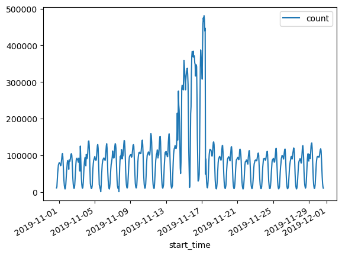

# Random Forest Classifier in PySpark - Lab

## Introduction  

In this lab, you will build a Random Forest Classifier model to study the ecommerce behavior of consumers from a multi-category store. First, you will need to download the data to your local machine, then you will load the data from the local machine onto a Pandas Dataframe.

## Objectives  

* Use the kaggle eCommerce dataset in PySpark
* Build and train a random forest classifier in PySpark

## Instruction
* Accept the Kaggle policy and download the data from [Kaggle](https://www.kaggle.com/code/tshephisho/ecommerce-behaviour-using-xgboost/data)
* For the first model you will only use the 2019-Nov csv data (which is still around ~2gb zipped)
* You will run this notebook in a new `pyspark-env` environment following [these setup instructions without docker](https://github.com/learn-co-curriculum/dsc-spark-docker-installation)


```python
!pip install pandas
```


```python
# import necessary libraries
import pandas as pd
import matplotlib.pyplot as plt
import matplotlib.dates as dates
from datetime import datetime
```


```python
# __SOLUTION__
# import necessary libraries
import pandas as pd
import matplotlib.pyplot as plt
import matplotlib.dates as dates
from datetime import datetime
```


```python
from pyspark.sql import SparkSession  # entry point for pyspark

# instantiate spark instance
spark = (
    SparkSession.builder.appName("Random Forest eCommerce")
    .config("spark.executor.memory", "4g")
    .config("spark.driver.memory", "4g")
    .master("local[*]")
    .getOrCreate()
)
```


```python
# __SOLUTION__
from pyspark.sql import SparkSession  # entry point for pyspark

# instantiate spark instance
spark = (
    SparkSession.builder.appName("Random Forest eCommerce")
    .config("spark.executor.memory", "4g")
    .config("spark.driver.memory", "4g")
    .master("local[*]")
    .getOrCreate()
)
```

    WARNING: An illegal reflective access operation has occurred
    WARNING: Illegal reflective access by org.apache.spark.unsafe.Platform (file:/Users/pisel/opt/anaconda3/envs/spark-env/lib/python3.8/site-packages/pyspark/jars/spark-unsafe_2.12-3.0.0.jar) to constructor java.nio.DirectByteBuffer(long,int)
    WARNING: Please consider reporting this to the maintainers of org.apache.spark.unsafe.Platform
    WARNING: Use --illegal-access=warn to enable warnings of further illegal reflective access operations
    WARNING: All illegal access operations will be denied in a future release
    23/09/06 12:57:45 WARN NativeCodeLoader: Unable to load native-hadoop library for your platform... using builtin-java classes where applicable
    Using Spark's default log4j profile: org/apache/spark/log4j-defaults.properties
    Setting default log level to "WARN".
    To adjust logging level use sc.setLogLevel(newLevel). For SparkR, use setLogLevel(newLevel).


```python
path = "../archive/2019-Nov.csv"  # wherever path you saved the kaggle file to
df = spark.read.csv(path, header=True, inferSchema=True)
df.printSchema()  # to see the schema
```


```python
# __SOLUTION__
path = "../archive/2019-Nov.csv"  # wherever path you saved the kaggle file to
df = spark.read.csv(path, header=True, inferSchema=True)
df.printSchema()  # to see the schema
```

                                                                                    

    root
     |-- event_time: string (nullable = true)
     |-- event_type: string (nullable = true)
     |-- product_id: integer (nullable = true)
     |-- category_id: long (nullable = true)
     |-- category_code: string (nullable = true)
     |-- brand: string (nullable = true)
     |-- price: double (nullable = true)
     |-- user_id: integer (nullable = true)
     |-- user_session: string (nullable = true)
    


If you want to use Pandas to explore the dataset instead of Pyspark, you have to use the `action` functions, which then means there will be a network shuffle. For smaller dataset such as the Iris dataset which is about ~1KB this is no problem. The current dataset may be too large, and may throw an `OutOfMemory` error if you attempt to load the data into a Pandas dataframe. You should only take a few rows for exploratory analysis if you are more comfortable with Pandas. Otherwise, stick with native PySpark functions. 


```python
pd.DataFrame(df.take(10), columns=df.columns).transpose()
```


<div>
<style scoped>
    .dataframe tbody tr th:only-of-type {
        vertical-align: middle;
    }

    .dataframe tbody tr th {
        vertical-align: top;
    }

    .dataframe thead th {
        text-align: right;
    }
</style>
<table border="1" class="dataframe">
  <thead>
    <tr style="text-align: right;">
      <th></th>
      <th>0</th>
      <th>1</th>
      <th>2</th>
      <th>3</th>
      <th>4</th>
      <th>5</th>
      <th>6</th>
      <th>7</th>
      <th>8</th>
      <th>9</th>
    </tr>
  </thead>
  <tbody>
    <tr>
      <th>event_time</th>
      <td>2019-11-01 00:00:00 UTC</td>
      <td>2019-11-01 00:00:00 UTC</td>
      <td>2019-11-01 00:00:01 UTC</td>
      <td>2019-11-01 00:00:01 UTC</td>
      <td>2019-11-01 00:00:01 UTC</td>
      <td>2019-11-01 00:00:01 UTC</td>
      <td>2019-11-01 00:00:01 UTC</td>
      <td>2019-11-01 00:00:02 UTC</td>
      <td>2019-11-01 00:00:02 UTC</td>
      <td>2019-11-01 00:00:02 UTC</td>
    </tr>
    <tr>
      <th>event_type</th>
      <td>view</td>
      <td>view</td>
      <td>view</td>
      <td>view</td>
      <td>view</td>
      <td>view</td>
      <td>view</td>
      <td>view</td>
      <td>view</td>
      <td>view</td>
    </tr>
    <tr>
      <th>product_id</th>
      <td>1003461</td>
      <td>5000088</td>
      <td>17302664</td>
      <td>3601530</td>
      <td>1004775</td>
      <td>1306894</td>
      <td>1306421</td>
      <td>15900065</td>
      <td>12708937</td>
      <td>1004258</td>
    </tr>
    <tr>
      <th>category_id</th>
      <td>2053013555631882655</td>
      <td>2053013566100866035</td>
      <td>2053013553853497655</td>
      <td>2053013563810775923</td>
      <td>2053013555631882655</td>
      <td>2053013558920217191</td>
      <td>2053013558920217191</td>
      <td>2053013558190408249</td>
      <td>2053013553559896355</td>
      <td>2053013555631882655</td>
    </tr>
    <tr>
      <th>category_code</th>
      <td>electronics.smartphone</td>
      <td>appliances.sewing_machine</td>
      <td>None</td>
      <td>appliances.kitchen.washer</td>
      <td>electronics.smartphone</td>
      <td>computers.notebook</td>
      <td>computers.notebook</td>
      <td>None</td>
      <td>None</td>
      <td>electronics.smartphone</td>
    </tr>
    <tr>
      <th>brand</th>
      <td>xiaomi</td>
      <td>janome</td>
      <td>creed</td>
      <td>lg</td>
      <td>xiaomi</td>
      <td>hp</td>
      <td>hp</td>
      <td>rondell</td>
      <td>michelin</td>
      <td>apple</td>
    </tr>
    <tr>
      <th>price</th>
      <td>489.07</td>
      <td>293.65</td>
      <td>28.31</td>
      <td>712.87</td>
      <td>183.27</td>
      <td>360.09</td>
      <td>514.56</td>
      <td>30.86</td>
      <td>72.72</td>
      <td>732.07</td>
    </tr>
    <tr>
      <th>user_id</th>
      <td>520088904</td>
      <td>530496790</td>
      <td>561587266</td>
      <td>518085591</td>
      <td>558856683</td>
      <td>520772685</td>
      <td>514028527</td>
      <td>518574284</td>
      <td>532364121</td>
      <td>532647354</td>
    </tr>
    <tr>
      <th>user_session</th>
      <td>4d3b30da-a5e4-49df-b1a8-ba5943f1dd33</td>
      <td>8e5f4f83-366c-4f70-860e-ca7417414283</td>
      <td>755422e7-9040-477b-9bd2-6a6e8fd97387</td>
      <td>3bfb58cd-7892-48cc-8020-2f17e6de6e7f</td>
      <td>313628f1-68b8-460d-84f6-cec7a8796ef2</td>
      <td>816a59f3-f5ae-4ccd-9b23-82aa8c23d33c</td>
      <td>df8184cc-3694-4549-8c8c-6b5171877376</td>
      <td>5e6ef132-4d7c-4730-8c7f-85aa4082588f</td>
      <td>0a899268-31eb-46de-898d-09b2da950b24</td>
      <td>d2d3d2c6-631d-489e-9fb5-06f340b85be0</td>
    </tr>
  </tbody>
</table>
</div>


### Know your Customers

How many unique customers visit the site?


```python
# using native pyspark
from pyspark.sql.functions import countDistinct

df.select(countDistinct("user_id")).show()
```

                                                                                    

    +-----------------------+
    |count(DISTINCT user_id)|
    +-----------------------+
    |                3696117|
    +-----------------------+
    


Did you notice the spark progress bar when you triggered the `action` function? The `show()` function is the `action` function which means the lazy evaluation of Spark was triggered and completed a certain job. `read.csv` should have been another job. If you go to `localhost:4040` you should be able to see 2 completed jobs under the `Jobs` tab, which are `csv` and `showString`. While a heavy job is getting executed, you can take a look at the `Executors` tab to examine the executors completing the tasks in parellel. Now, you may not see if we run this on a local machine, but this behavior should definitely be visible if you're on a cloud system, such as EMR.

### (Optional) Visitors Daily Trend

Does traffic flunctuate by date? Try using the event_time to see traffic, and draw the plots for visualization.


```python
# for event_time you should use a window and groupby a time period
from pyspark.sql.functions import window
```


```python
# __SOLUTION__
# for event_time you should use a window and groupby a time period
from pyspark.sql.functions import window

df_time = df.withColumn("hour", window(df.event_time, "1 hour"))
time_df_grouped = df_time.groupBy("hour").count().sort("hour").toPandas()
time_df_grouped["start_time"] = time_df_grouped.hour.str[0].values
time_df_grouped.plot(x="start_time", y="count")
```

                                                                                    


    <Axes: xlabel='start_time'>


    

    


Question: You would still like to see the cart abandonment rate using the dataset. What relevant features can we use for modeling?


```python
# your answer
```


```python
# __SOLUTION__
# user_id, product_id, and event_type would be useful
```

Now, you will start building the model. Add the columns you would like to use for predictor features in the model to the `feature_cols` list


```python
from pyspark.ml.feature import VectorAssembler

feature_cols = []  # columns you'd like to use
assembler = VectorAssembler(inputCols=feature_cols, outputCol="features")
df = assembler.transform(df)
df.show()
```


```python
# __SOLUTION__

from pyspark.ml.feature import VectorAssembler

feature_cols = [
    "user_id",
    "product_id",
    "category_id",
    "price",
]  # columns you'd like to use
assembler = VectorAssembler(inputCols=feature_cols, outputCol="features")
df = assembler.transform(df)
df.show()
```

    +--------------------+----------+----------+-------------------+--------------------+--------+------+---------+--------------------+--------------------+
    |          event_time|event_type|product_id|        category_id|       category_code|   brand| price|  user_id|        user_session|            features|
    +--------------------+----------+----------+-------------------+--------------------+--------+------+---------+--------------------+--------------------+
    |2019-11-01 00:00:...|      view|   1003461|2053013555631882655|electronics.smart...|  xiaomi|489.07|520088904|4d3b30da-a5e4-49d...|[5.20088904E8,100...|
    |2019-11-01 00:00:...|      view|   5000088|2053013566100866035|appliances.sewing...|  janome|293.65|530496790|8e5f4f83-366c-4f7...|[5.3049679E8,5000...|
    |2019-11-01 00:00:...|      view|  17302664|2053013553853497655|                null|   creed| 28.31|561587266|755422e7-9040-477...|[5.61587266E8,1.7...|
    |2019-11-01 00:00:...|      view|   3601530|2053013563810775923|appliances.kitche...|      lg|712.87|518085591|3bfb58cd-7892-48c...|[5.18085591E8,360...|
    |2019-11-01 00:00:...|      view|   1004775|2053013555631882655|electronics.smart...|  xiaomi|183.27|558856683|313628f1-68b8-460...|[5.58856683E8,100...|
    |2019-11-01 00:00:...|      view|   1306894|2053013558920217191|  computers.notebook|      hp|360.09|520772685|816a59f3-f5ae-4cc...|[5.20772685E8,130...|
    |2019-11-01 00:00:...|      view|   1306421|2053013558920217191|  computers.notebook|      hp|514.56|514028527|df8184cc-3694-454...|[5.14028527E8,130...|
    |2019-11-01 00:00:...|      view|  15900065|2053013558190408249|                null| rondell| 30.86|518574284|5e6ef132-4d7c-473...|[5.18574284E8,1.5...|
    |2019-11-01 00:00:...|      view|  12708937|2053013553559896355|                null|michelin| 72.72|532364121|0a899268-31eb-46d...|[5.32364121E8,1.2...|
    |2019-11-01 00:00:...|      view|   1004258|2053013555631882655|electronics.smart...|   apple|732.07|532647354|d2d3d2c6-631d-489...|[5.32647354E8,100...|
    |2019-11-01 00:00:...|      view|  17200570|2053013559792632471|furniture.living_...|    null|437.33|518780843|aa806835-b14c-45a...|[5.18780843E8,1.7...|
    |2019-11-01 00:00:...|      view|   2701517|2053013563911439225|appliances.kitche...|    null|155.11|518427361|c89b0d96-247f-404...|[5.18427361E8,270...|
    |2019-11-01 00:00:...|      view|  16700260|2053013559901684381|furniture.kitchen...|    null| 31.64|566255262|173d7b72-1db7-463...|[5.66255262E8,1.6...|
    |2019-11-01 00:00:...|      view|  34600011|2060981320581906480|                null|    null| 20.54|512416379|4dfe2c67-e537-4dc...|[5.12416379E8,3.4...|
    |2019-11-01 00:00:...|      view|   4600658|2053013563944993659|appliances.kitche...| samsung|411.83|526595547|aab33a9a-29c3-4d5...|[5.26595547E8,460...|
    |2019-11-01 00:00:...|      view|  24900193|2053013562183385881|                null|    null|  1.09|512651494|f603c815-f51a-46f...|[5.12651494E8,2.4...|
    |2019-11-01 00:00:...|      view|  27400066|2053013563391345499|                null|    null|  8.55|551061950|3f6112f1-5695-4e8...|[5.5106195E8,2.74...|
    |2019-11-01 00:00:...|      view|   5100503|2053013553375346967|                null|  xiaomi| 22.68|520037415|f54fa96a-f3f2-43a...|[5.20037415E8,510...|
    |2019-11-01 00:00:...|      view|   1004566|2053013555631882655|electronics.smart...|  huawei|164.84|566265908|52c2c76c-b79e-479...|[5.66265908E8,100...|
    |2019-11-01 00:00:...|      view|   1307115|2053013558920217191|  computers.notebook|      hp|411.59|514028527|df8184cc-3694-454...|[5.14028527E8,130...|
    +--------------------+----------+----------+-------------------+--------------------+--------+------+---------+--------------------+--------------------+
    only showing top 20 rows
    


To use a string column, you can use the `StringIndexer` to encode the column. Update the `inputCol` keyword argument so that you can encode the target feature.


```python
from pyspark.ml.feature import StringIndexer

labeler = StringIndexer(
    inputCol="", outputCol="encoded"
)  # what should we use for the inputCol here?
df = labeler.fit(df).transform(df)
df.show()
```


```python
# __SOLUTION__
from pyspark.ml.feature import StringIndexer

labeler = StringIndexer(
    inputCol="event_type", outputCol="encoded"
)  # what should we use for the inputCol here?
df = labeler.fit(df).transform(df)
df.show()
```

                                                                                    

    +--------------------+----------+----------+-------------------+--------------------+--------+------+---------+--------------------+--------------------+-------+
    |          event_time|event_type|product_id|        category_id|       category_code|   brand| price|  user_id|        user_session|            features|encoded|
    +--------------------+----------+----------+-------------------+--------------------+--------+------+---------+--------------------+--------------------+-------+
    |2019-11-01 00:00:...|      view|   1003461|2053013555631882655|electronics.smart...|  xiaomi|489.07|520088904|4d3b30da-a5e4-49d...|[5.20088904E8,100...|    0.0|
    |2019-11-01 00:00:...|      view|   5000088|2053013566100866035|appliances.sewing...|  janome|293.65|530496790|8e5f4f83-366c-4f7...|[5.3049679E8,5000...|    0.0|
    |2019-11-01 00:00:...|      view|  17302664|2053013553853497655|                null|   creed| 28.31|561587266|755422e7-9040-477...|[5.61587266E8,1.7...|    0.0|
    |2019-11-01 00:00:...|      view|   3601530|2053013563810775923|appliances.kitche...|      lg|712.87|518085591|3bfb58cd-7892-48c...|[5.18085591E8,360...|    0.0|
    |2019-11-01 00:00:...|      view|   1004775|2053013555631882655|electronics.smart...|  xiaomi|183.27|558856683|313628f1-68b8-460...|[5.58856683E8,100...|    0.0|
    |2019-11-01 00:00:...|      view|   1306894|2053013558920217191|  computers.notebook|      hp|360.09|520772685|816a59f3-f5ae-4cc...|[5.20772685E8,130...|    0.0|
    |2019-11-01 00:00:...|      view|   1306421|2053013558920217191|  computers.notebook|      hp|514.56|514028527|df8184cc-3694-454...|[5.14028527E8,130...|    0.0|
    |2019-11-01 00:00:...|      view|  15900065|2053013558190408249|                null| rondell| 30.86|518574284|5e6ef132-4d7c-473...|[5.18574284E8,1.5...|    0.0|
    |2019-11-01 00:00:...|      view|  12708937|2053013553559896355|                null|michelin| 72.72|532364121|0a899268-31eb-46d...|[5.32364121E8,1.2...|    0.0|
    |2019-11-01 00:00:...|      view|   1004258|2053013555631882655|electronics.smart...|   apple|732.07|532647354|d2d3d2c6-631d-489...|[5.32647354E8,100...|    0.0|
    |2019-11-01 00:00:...|      view|  17200570|2053013559792632471|furniture.living_...|    null|437.33|518780843|aa806835-b14c-45a...|[5.18780843E8,1.7...|    0.0|
    |2019-11-01 00:00:...|      view|   2701517|2053013563911439225|appliances.kitche...|    null|155.11|518427361|c89b0d96-247f-404...|[5.18427361E8,270...|    0.0|
    |2019-11-01 00:00:...|      view|  16700260|2053013559901684381|furniture.kitchen...|    null| 31.64|566255262|173d7b72-1db7-463...|[5.66255262E8,1.6...|    0.0|
    |2019-11-01 00:00:...|      view|  34600011|2060981320581906480|                null|    null| 20.54|512416379|4dfe2c67-e537-4dc...|[5.12416379E8,3.4...|    0.0|
    |2019-11-01 00:00:...|      view|   4600658|2053013563944993659|appliances.kitche...| samsung|411.83|526595547|aab33a9a-29c3-4d5...|[5.26595547E8,460...|    0.0|
    |2019-11-01 00:00:...|      view|  24900193|2053013562183385881|                null|    null|  1.09|512651494|f603c815-f51a-46f...|[5.12651494E8,2.4...|    0.0|
    |2019-11-01 00:00:...|      view|  27400066|2053013563391345499|                null|    null|  8.55|551061950|3f6112f1-5695-4e8...|[5.5106195E8,2.74...|    0.0|
    |2019-11-01 00:00:...|      view|   5100503|2053013553375346967|                null|  xiaomi| 22.68|520037415|f54fa96a-f3f2-43a...|[5.20037415E8,510...|    0.0|
    |2019-11-01 00:00:...|      view|   1004566|2053013555631882655|electronics.smart...|  huawei|164.84|566265908|52c2c76c-b79e-479...|[5.66265908E8,100...|    0.0|
    |2019-11-01 00:00:...|      view|   1307115|2053013558920217191|  computers.notebook|      hp|411.59|514028527|df8184cc-3694-454...|[5.14028527E8,130...|    0.0|
    +--------------------+----------+----------+-------------------+--------------------+--------+------+---------+--------------------+--------------------+-------+
    only showing top 20 rows
    


Now build the train/test dataset with a 70/30 `randomSplit` and a random seed set to 42


```python
train, test = df.randomSplit()
print("Training Dataset Count: " + str(train.count()))
print("Test Dataset Count: " + str(test.count()))
```


```python
# __SOLUTION__
train, test = df.randomSplit([0.7, 0.3], seed=42)
print("Training Dataset Count: " + str(train.count()))
print("Test Dataset Count: " + str(test.count()))
```

                                                                                    

    Training Dataset Count: 47253900


    [Stage 17:==================================================>     (61 + 7) / 68]

    Test Dataset Count: 20248079


                                                                                    

Next you need to add in the name of the feature column and the name of the `labelCol` you previously encoded for training the model.


```python
from pyspark.ml.classification import RandomForestClassifier

rf = RandomForestClassifier(featuresCol="", labelCol="")
model = rf.fit(train)
predictions = model.transform(test)
# what goes in the select() function?
predictions.select().show(25)
```


```python
# __SOLUTION__
from pyspark.ml.classification import RandomForestClassifier

rf = RandomForestClassifier(featuresCol="features", labelCol="encoded")
model = rf.fit(train)
predictions = model.transform(test)
# what goes in the select() function?
# predictions.select().show(25)
```

    23/09/06 13:03:37 WARN MemoryStore: Not enough space to cache rdd_87_6 in memory! (computed 92.5 MiB so far)
    23/09/06 13:03:37 WARN MemoryStore: Not enough space to cache rdd_87_0 in memory! (computed 92.5 MiB so far)
    23/09/06 13:03:37 WARN BlockManager: Persisting block rdd_87_0 to disk instead.
    23/09/06 13:03:37 WARN BlockManager: Persisting block rdd_87_6 to disk instead.
    23/09/06 13:03:50 WARN MemoryStore: Not enough space to cache rdd_87_13 in memory! (computed 92.5 MiB so far)
    23/09/06 13:03:50 WARN BlockManager: Persisting block rdd_87_13 to disk instead.
    23/09/06 13:03:51 WARN MemoryStore: Not enough space to cache rdd_87_17 in memory! (computed 61.6 MiB so far)
    23/09/06 13:03:51 WARN MemoryStore: Not enough space to cache rdd_87_11 in memory! (computed 61.6 MiB so far)
    23/09/06 13:03:51 WARN BlockManager: Persisting block rdd_87_11 to disk instead.
    23/09/06 13:03:51 WARN BlockManager: Persisting block rdd_87_17 to disk instead.
    23/09/06 13:03:56 WARN MemoryStore: Not enough space to cache rdd_87_19 in memory! (computed 92.5 MiB so far)
    23/09/06 13:03:57 WARN BlockManager: Persisting block rdd_87_19 to disk instead.
    23/09/06 13:04:00 WARN MemoryStore: Not enough space to cache rdd_87_19 in memory! (computed 27.4 MiB so far)
    23/09/06 13:04:05 WARN MemoryStore: Not enough space to cache rdd_87_20 in memory! (computed 61.6 MiB so far)
    23/09/06 13:04:05 WARN BlockManager: Persisting block rdd_87_20 to disk instead.
    23/09/06 13:04:06 WARN MemoryStore: Not enough space to cache rdd_87_26 in memory! (computed 7.7 MiB so far)
    23/09/06 13:04:06 WARN BlockManager: Persisting block rdd_87_26 to disk instead.
    23/09/06 13:04:06 WARN MemoryStore: Not enough space to cache rdd_87_25 in memory! (computed 27.4 MiB so far)
    23/09/06 13:04:06 WARN BlockManager: Persisting block rdd_87_25 to disk instead.
    23/09/06 13:04:08 WARN MemoryStore: Not enough space to cache rdd_87_22 in memory! (computed 92.5 MiB so far)
    23/09/06 13:04:08 WARN BlockManager: Persisting block rdd_87_22 to disk instead.
    23/09/06 13:04:08 WARN MemoryStore: Not enough space to cache rdd_87_27 in memory! (computed 17.8 MiB so far)
    23/09/06 13:04:08 WARN BlockManager: Persisting block rdd_87_27 to disk instead.
    23/09/06 13:04:10 WARN MemoryStore: Not enough space to cache rdd_87_29 in memory! (computed 11.5 MiB so far)
    23/09/06 13:04:11 WARN BlockManager: Persisting block rdd_87_29 to disk instead.
    23/09/06 13:04:12 WARN MemoryStore: Not enough space to cache rdd_87_25 in memory! (computed 61.6 MiB so far)
    23/09/06 13:04:13 WARN MemoryStore: Not enough space to cache rdd_87_27 in memory! (computed 61.6 MiB so far)
    23/09/06 13:04:22 WARN MemoryStore: Not enough space to cache rdd_87_33 in memory! (computed 61.6 MiB so far)
    23/09/06 13:04:22 WARN BlockManager: Persisting block rdd_87_33 to disk instead.
    23/09/06 13:04:22 WARN MemoryStore: Not enough space to cache rdd_87_34 in memory! (computed 11.5 MiB so far)
    23/09/06 13:04:22 WARN BlockManager: Persisting block rdd_87_34 to disk instead.
    23/09/06 13:04:22 WARN MemoryStore: Not enough space to cache rdd_87_35 in memory! (computed 3.4 MiB so far)
    23/09/06 13:04:22 WARN BlockManager: Persisting block rdd_87_35 to disk instead.
    23/09/06 13:04:22 WARN MemoryStore: Not enough space to cache rdd_87_37 in memory! (computed 17.8 MiB so far)
    23/09/06 13:04:22 WARN BlockManager: Persisting block rdd_87_37 to disk instead.
    23/09/06 13:04:22 WARN MemoryStore: Not enough space to cache rdd_87_36 in memory! (computed 11.5 MiB so far)
    23/09/06 13:04:22 WARN BlockManager: Persisting block rdd_87_36 to disk instead.
    23/09/06 13:04:25 WARN MemoryStore: Not enough space to cache rdd_87_39 in memory! (computed 41.1 MiB so far)
    23/09/06 13:04:25 WARN BlockManager: Persisting block rdd_87_39 to disk instead.
    23/09/06 13:04:27 WARN MemoryStore: Not enough space to cache rdd_87_36 in memory! (computed 61.6 MiB so far)
    23/09/06 13:04:31 WARN MemoryStore: Not enough space to cache rdd_87_39 in memory! (computed 92.5 MiB so far)
    23/09/06 13:04:39 WARN MemoryStore: Not enough space to cache rdd_87_46 in memory! (computed 41.1 MiB so far)
    23/09/06 13:04:39 WARN BlockManager: Persisting block rdd_87_46 to disk instead.
    23/09/06 13:04:40 WARN MemoryStore: Not enough space to cache rdd_87_43 in memory! (computed 41.1 MiB so far)
    23/09/06 13:04:40 WARN BlockManager: Persisting block rdd_87_43 to disk instead.
    23/09/06 13:04:47 WARN MemoryStore: Not enough space to cache rdd_87_50 in memory! (computed 61.6 MiB so far)
    23/09/06 13:04:48 WARN BlockManager: Persisting block rdd_87_50 to disk instead.
    23/09/06 13:04:56 WARN MemoryStore: Not enough space to cache rdd_87_58 in memory! (computed 11.5 MiB so far)
    23/09/06 13:04:57 WARN BlockManager: Persisting block rdd_87_58 to disk instead.
    23/09/06 13:05:02 WARN MemoryStore: Not enough space to cache rdd_87_61 in memory! (computed 3.4 MiB so far)
    23/09/06 13:05:02 WARN MemoryStore: Not enough space to cache rdd_87_60 in memory! (computed 2.3 MiB so far)
    23/09/06 13:05:02 WARN BlockManager: Persisting block rdd_87_61 to disk instead.
    23/09/06 13:05:02 WARN BlockManager: Persisting block rdd_87_60 to disk instead.
    23/09/06 13:05:07 WARN MemoryStore: Not enough space to cache rdd_87_63 in memory! (computed 27.4 MiB so far)
    23/09/06 13:05:07 WARN BlockManager: Persisting block rdd_87_63 to disk instead.
    23/09/06 13:05:09 WARN MemoryStore: Not enough space to cache rdd_87_66 in memory! (computed 41.1 MiB so far)
    23/09/06 13:05:09 WARN BlockManager: Persisting block rdd_87_66 to disk instead.
    23/09/06 13:05:09 WARN MemoryStore: Not enough space to cache rdd_87_65 in memory! (computed 41.1 MiB so far)
    23/09/06 13:05:09 WARN BlockManager: Persisting block rdd_87_65 to disk instead.
    23/09/06 13:05:14 WARN MemoryStore: Not enough space to cache rdd_87_1 in memory! (computed 27.4 MiB so far)
    23/09/06 13:05:14 WARN MemoryStore: Not enough space to cache rdd_87_0 in memory! (computed 27.4 MiB so far)
    23/09/06 13:05:14 WARN MemoryStore: Not enough space to cache rdd_87_7 in memory! (computed 27.4 MiB so far)
    23/09/06 13:05:14 WARN MemoryStore: Not enough space to cache rdd_87_5 in memory! (computed 27.4 MiB so far)
    23/09/06 13:05:14 WARN MemoryStore: Not enough space to cache rdd_87_8 in memory! (computed 27.4 MiB so far)
    23/09/06 13:05:14 WARN MemoryStore: Not enough space to cache rdd_87_4 in memory! (computed 27.4 MiB so far)
    23/09/06 13:05:14 WARN MemoryStore: Not enough space to cache rdd_87_2 in memory! (computed 27.4 MiB so far)
    23/09/06 13:05:14 WARN MemoryStore: Not enough space to cache rdd_87_6 in memory! (computed 27.4 MiB so far)
    23/09/06 13:05:14 WARN MemoryStore: Not enough space to cache rdd_87_9 in memory! (computed 27.4 MiB so far)
    23/09/06 13:05:14 WARN MemoryStore: Not enough space to cache rdd_87_3 in memory! (computed 41.1 MiB so far)
    23/09/06 13:05:17 WARN MemoryStore: Not enough space to cache rdd_87_14 in memory! (computed 27.4 MiB so far)
    23/09/06 13:05:17 WARN MemoryStore: Not enough space to cache rdd_87_12 in memory! (computed 17.8 MiB so far)
    23/09/06 13:05:17 WARN MemoryStore: Not enough space to cache rdd_87_18 in memory! (computed 27.4 MiB so far)
    23/09/06 13:05:17 WARN MemoryStore: Not enough space to cache rdd_87_10 in memory! (computed 27.4 MiB so far)
    23/09/06 13:05:17 WARN MemoryStore: Not enough space to cache rdd_87_13 in memory! (computed 27.4 MiB so far)
    23/09/06 13:05:17 WARN MemoryStore: Not enough space to cache rdd_87_19 in memory! (computed 27.4 MiB so far)
    23/09/06 13:05:17 WARN MemoryStore: Not enough space to cache rdd_87_16 in memory! (computed 27.4 MiB so far)
    23/09/06 13:05:17 WARN MemoryStore: Not enough space to cache rdd_87_17 in memory! (computed 27.4 MiB so far)
    23/09/06 13:05:17 WARN MemoryStore: Not enough space to cache rdd_87_15 in memory! (computed 41.1 MiB so far)
    23/09/06 13:05:17 WARN MemoryStore: Not enough space to cache rdd_87_11 in memory! (computed 41.1 MiB so far)
    23/09/06 13:05:20 WARN MemoryStore: Not enough space to cache rdd_87_23 in memory! (computed 41.1 MiB so far)
    23/09/06 13:05:20 WARN MemoryStore: Not enough space to cache rdd_87_22 in memory! (computed 41.1 MiB so far)
    23/09/06 13:05:20 WARN MemoryStore: Not enough space to cache rdd_87_21 in memory! (computed 41.1 MiB so far)
    23/09/06 13:05:20 WARN MemoryStore: Not enough space to cache rdd_87_20 in memory! (computed 41.1 MiB so far)
    23/09/06 13:05:20 WARN MemoryStore: Not enough space to cache rdd_87_24 in memory! (computed 41.1 MiB so far)
    23/09/06 13:05:20 WARN MemoryStore: Not enough space to cache rdd_87_25 in memory! (computed 41.1 MiB so far)
    23/09/06 13:05:20 WARN MemoryStore: Failed to reserve initial memory threshold of 1024.0 KiB for computing block rdd_87_27 in memory.
    23/09/06 13:05:20 WARN MemoryStore: Not enough space to cache rdd_87_27 in memory! (computed 384.0 B so far)
    23/09/06 13:05:20 WARN MemoryStore: Failed to reserve initial memory threshold of 1024.0 KiB for computing block rdd_87_28 in memory.
    23/09/06 13:05:20 WARN MemoryStore: Not enough space to cache rdd_87_28 in memory! (computed 384.0 B so far)
    23/09/06 13:05:20 WARN MemoryStore: Failed to reserve initial memory threshold of 1024.0 KiB for computing block rdd_87_29 in memory.
    23/09/06 13:05:20 WARN MemoryStore: Not enough space to cache rdd_87_29 in memory! (computed 384.0 B so far)
    23/09/06 13:05:20 WARN MemoryStore: Not enough space to cache rdd_87_26 in memory! (computed 41.1 MiB so far)
    23/09/06 13:05:22 WARN MemoryStore: Not enough space to cache rdd_87_31 in memory! (computed 41.1 MiB so far)
    23/09/06 13:05:22 WARN MemoryStore: Not enough space to cache rdd_87_32 in memory! (computed 41.1 MiB so far)
    23/09/06 13:05:22 WARN MemoryStore: Not enough space to cache rdd_87_35 in memory! (computed 7.7 MiB so far)
    23/09/06 13:05:22 WARN MemoryStore: Not enough space to cache rdd_87_34 in memory! (computed 41.1 MiB so far)
    23/09/06 13:05:23 WARN MemoryStore: Not enough space to cache rdd_87_36 in memory! (computed 3.4 MiB so far)
    23/09/06 13:05:23 WARN MemoryStore: Not enough space to cache rdd_87_33 in memory! (computed 61.6 MiB so far)
    23/09/06 13:05:23 WARN MemoryStore: Not enough space to cache rdd_87_30 in memory! (computed 92.5 MiB so far)
    23/09/06 13:05:23 WARN MemoryStore: Not enough space to cache rdd_87_37 in memory! (computed 7.7 MiB so far)
    23/09/06 13:05:24 WARN MemoryStore: Not enough space to cache rdd_87_39 in memory! (computed 92.5 MiB so far)
    23/09/06 13:05:24 WARN MemoryStore: Not enough space to cache rdd_87_38 in memory! (computed 92.5 MiB so far)
    23/09/06 13:05:25 WARN MemoryStore: Not enough space to cache rdd_87_47 in memory! (computed 1026.2 KiB so far)
    23/09/06 13:05:25 WARN MemoryStore: Not enough space to cache rdd_87_45 in memory! (computed 27.4 MiB so far)
    23/09/06 13:05:25 WARN MemoryStore: Not enough space to cache rdd_87_44 in memory! (computed 27.4 MiB so far)
    23/09/06 13:05:25 WARN MemoryStore: Not enough space to cache rdd_87_46 in memory! (computed 7.7 MiB so far)
    23/09/06 13:05:25 WARN MemoryStore: Not enough space to cache rdd_87_40 in memory! (computed 61.6 MiB so far)
    23/09/06 13:05:25 WARN MemoryStore: Not enough space to cache rdd_87_43 in memory! (computed 41.1 MiB so far)
    23/09/06 13:05:25 WARN MemoryStore: Not enough space to cache rdd_87_42 in memory! (computed 61.6 MiB so far)
    23/09/06 13:05:25 WARN MemoryStore: Not enough space to cache rdd_87_41 in memory! (computed 61.6 MiB so far)
    23/09/06 13:05:28 WARN MemoryStore: Not enough space to cache rdd_87_52 in memory! (computed 11.5 MiB so far)
    23/09/06 13:05:28 WARN MemoryStore: Not enough space to cache rdd_87_51 in memory! (computed 11.5 MiB so far)
    23/09/06 13:05:32 WARN MemoryStore: Not enough space to cache rdd_87_6 in memory! (computed 2.3 MiB so far)
    23/09/06 13:05:32 WARN MemoryStore: Not enough space to cache rdd_87_5 in memory! (computed 1541.0 KiB so far)
    23/09/06 13:05:32 WARN MemoryStore: Not enough space to cache rdd_87_3 in memory! (computed 1541.0 KiB so far)
    23/09/06 13:05:32 WARN MemoryStore: Not enough space to cache rdd_87_2 in memory! (computed 1541.0 KiB so far)
    23/09/06 13:05:32 WARN MemoryStore: Not enough space to cache rdd_87_8 in memory! (computed 1026.2 KiB so far)
    23/09/06 13:05:32 WARN MemoryStore: Not enough space to cache rdd_87_9 in memory! (computed 1541.0 KiB so far)
    23/09/06 13:05:32 WARN MemoryStore: Not enough space to cache rdd_87_7 in memory! (computed 2.3 MiB so far)
    23/09/06 13:05:32 WARN MemoryStore: Not enough space to cache rdd_87_1 in memory! (computed 2.3 MiB so far)
    23/09/06 13:05:32 WARN MemoryStore: Not enough space to cache rdd_87_0 in memory! (computed 5.1 MiB so far)
    23/09/06 13:05:32 WARN MemoryStore: Not enough space to cache rdd_87_4 in memory! (computed 5.1 MiB so far)
    23/09/06 13:05:35 WARN MemoryStore: Not enough space to cache rdd_87_18 in memory! (computed 1541.0 KiB so far)
    23/09/06 13:05:35 WARN MemoryStore: Not enough space to cache rdd_87_11 in memory! (computed 1541.0 KiB so far)
    23/09/06 13:05:35 WARN MemoryStore: Not enough space to cache rdd_87_12 in memory! (computed 1541.0 KiB so far)
    23/09/06 13:05:35 WARN MemoryStore: Not enough space to cache rdd_87_13 in memory! (computed 2.3 MiB so far)
    23/09/06 13:05:35 WARN MemoryStore: Not enough space to cache rdd_87_16 in memory! (computed 3.4 MiB so far)
    23/09/06 13:05:35 WARN MemoryStore: Not enough space to cache rdd_87_15 in memory! (computed 3.4 MiB so far)
    23/09/06 13:05:35 WARN MemoryStore: Not enough space to cache rdd_87_14 in memory! (computed 2.3 MiB so far)
    23/09/06 13:05:35 WARN MemoryStore: Not enough space to cache rdd_87_17 in memory! (computed 2.3 MiB so far)
    23/09/06 13:05:35 WARN MemoryStore: Not enough space to cache rdd_87_10 in memory! (computed 2.3 MiB so far)
    23/09/06 13:05:35 WARN MemoryStore: Not enough space to cache rdd_87_19 in memory! (computed 3.4 MiB so far)
    23/09/06 13:05:38 WARN MemoryStore: Not enough space to cache rdd_87_23 in memory! (computed 2.3 MiB so far)
    23/09/06 13:05:38 WARN MemoryStore: Not enough space to cache rdd_87_26 in memory! (computed 1541.0 KiB so far)
    23/09/06 13:05:38 WARN MemoryStore: Not enough space to cache rdd_87_28 in memory! (computed 2.3 MiB so far)
    23/09/06 13:05:38 WARN MemoryStore: Not enough space to cache rdd_87_25 in memory! (computed 3.4 MiB so far)
    23/09/06 13:05:38 WARN MemoryStore: Not enough space to cache rdd_87_21 in memory! (computed 2.3 MiB so far)
    23/09/06 13:05:38 WARN MemoryStore: Not enough space to cache rdd_87_29 in memory! (computed 2.3 MiB so far)
    23/09/06 13:05:38 WARN MemoryStore: Not enough space to cache rdd_87_24 in memory! (computed 2.3 MiB so far)
    23/09/06 13:05:38 WARN MemoryStore: Not enough space to cache rdd_87_20 in memory! (computed 3.4 MiB so far)
    23/09/06 13:05:38 WARN MemoryStore: Not enough space to cache rdd_87_27 in memory! (computed 2.3 MiB so far)
    23/09/06 13:05:38 WARN MemoryStore: Not enough space to cache rdd_87_22 in memory! (computed 2.3 MiB so far)
    23/09/06 13:05:41 WARN MemoryStore: Not enough space to cache rdd_87_38 in memory! (computed 2.3 MiB so far)
    23/09/06 13:05:41 WARN MemoryStore: Not enough space to cache rdd_87_34 in memory! (computed 2.3 MiB so far)
    23/09/06 13:05:41 WARN MemoryStore: Not enough space to cache rdd_87_30 in memory! (computed 2.3 MiB so far)
    23/09/06 13:05:41 WARN MemoryStore: Not enough space to cache rdd_87_33 in memory! (computed 3.4 MiB so far)
    23/09/06 13:05:41 WARN MemoryStore: Not enough space to cache rdd_87_37 in memory! (computed 2.3 MiB so far)
    23/09/06 13:05:41 WARN MemoryStore: Not enough space to cache rdd_87_32 in memory! (computed 3.4 MiB so far)
    23/09/06 13:05:41 WARN MemoryStore: Not enough space to cache rdd_87_31 in memory! (computed 3.4 MiB so far)
    23/09/06 13:05:41 WARN MemoryStore: Not enough space to cache rdd_87_35 in memory! (computed 1541.0 KiB so far)
    23/09/06 13:05:41 WARN MemoryStore: Not enough space to cache rdd_87_36 in memory! (computed 3.4 MiB so far)
    23/09/06 13:05:41 WARN MemoryStore: Not enough space to cache rdd_87_39 in memory! (computed 17.8 MiB so far)
    23/09/06 13:05:44 WARN MemoryStore: Not enough space to cache rdd_87_46 in memory! (computed 3.4 MiB so far)
    23/09/06 13:05:44 WARN MemoryStore: Not enough space to cache rdd_87_43 in memory! (computed 3.4 MiB so far)
    23/09/06 13:05:44 WARN MemoryStore: Not enough space to cache rdd_87_47 in memory! (computed 3.4 MiB so far)
    23/09/06 13:05:44 WARN MemoryStore: Not enough space to cache rdd_87_42 in memory! (computed 3.4 MiB so far)
    23/09/06 13:05:44 WARN MemoryStore: Not enough space to cache rdd_87_44 in memory! (computed 2.3 MiB so far)
    23/09/06 13:05:44 WARN MemoryStore: Not enough space to cache rdd_87_41 in memory! (computed 1541.0 KiB so far)
    23/09/06 13:05:44 WARN MemoryStore: Not enough space to cache rdd_87_40 in memory! (computed 3.4 MiB so far)
    23/09/06 13:05:44 WARN MemoryStore: Not enough space to cache rdd_87_45 in memory! (computed 3.4 MiB so far)
    23/09/06 13:05:47 WARN MemoryStore: Not enough space to cache rdd_87_51 in memory! (computed 17.8 MiB so far)
    23/09/06 13:05:48 WARN MemoryStore: Not enough space to cache rdd_87_52 in memory! (computed 17.8 MiB so far)
    23/09/06 13:05:52 WARN MemoryStore: Not enough space to cache rdd_87_2 in memory! (computed 2.3 MiB so far)
    23/09/06 13:05:52 WARN MemoryStore: Not enough space to cache rdd_87_3 in memory! (computed 2.3 MiB so far)
    23/09/06 13:05:52 WARN MemoryStore: Not enough space to cache rdd_87_8 in memory! (computed 2.3 MiB so far)
    23/09/06 13:05:52 WARN MemoryStore: Not enough space to cache rdd_87_6 in memory! (computed 2.3 MiB so far)
    23/09/06 13:05:52 WARN MemoryStore: Not enough space to cache rdd_87_9 in memory! (computed 2.3 MiB so far)
    23/09/06 13:05:52 WARN MemoryStore: Not enough space to cache rdd_87_5 in memory! (computed 3.4 MiB so far)
    23/09/06 13:05:52 WARN MemoryStore: Not enough space to cache rdd_87_7 in memory! (computed 1541.0 KiB so far)
    23/09/06 13:05:52 WARN MemoryStore: Not enough space to cache rdd_87_0 in memory! (computed 5.1 MiB so far)
    23/09/06 13:05:52 WARN MemoryStore: Not enough space to cache rdd_87_4 in memory! (computed 1026.2 KiB so far)
    23/09/06 13:05:52 WARN MemoryStore: Not enough space to cache rdd_87_1 in memory! (computed 1541.0 KiB so far)
    23/09/06 13:05:57 WARN MemoryStore: Not enough space to cache rdd_87_12 in memory! (computed 2.3 MiB so far)
    23/09/06 13:05:57 WARN MemoryStore: Not enough space to cache rdd_87_11 in memory! (computed 1026.2 KiB so far)
    23/09/06 13:05:57 WARN MemoryStore: Not enough space to cache rdd_87_19 in memory! (computed 1026.2 KiB so far)
    23/09/06 13:05:57 WARN MemoryStore: Not enough space to cache rdd_87_14 in memory! (computed 2.3 MiB so far)
    23/09/06 13:05:57 WARN MemoryStore: Not enough space to cache rdd_87_16 in memory! (computed 2.3 MiB so far)
    23/09/06 13:05:57 WARN MemoryStore: Not enough space to cache rdd_87_17 in memory! (computed 3.4 MiB so far)
    23/09/06 13:05:57 WARN MemoryStore: Not enough space to cache rdd_87_10 in memory! (computed 2.3 MiB so far)
    23/09/06 13:05:57 WARN MemoryStore: Not enough space to cache rdd_87_18 in memory! (computed 2.3 MiB so far)
    23/09/06 13:05:57 WARN MemoryStore: Not enough space to cache rdd_87_15 in memory! (computed 2.3 MiB so far)
    23/09/06 13:05:57 WARN MemoryStore: Not enough space to cache rdd_87_13 in memory! (computed 5.1 MiB so far)
    23/09/06 13:06:01 WARN MemoryStore: Not enough space to cache rdd_87_26 in memory! (computed 2.3 MiB so far)
    23/09/06 13:06:01 WARN MemoryStore: Not enough space to cache rdd_87_29 in memory! (computed 2.3 MiB so far)
    23/09/06 13:06:01 WARN MemoryStore: Not enough space to cache rdd_87_22 in memory! (computed 3.4 MiB so far)
    23/09/06 13:06:01 WARN MemoryStore: Not enough space to cache rdd_87_28 in memory! (computed 2.3 MiB so far)
    23/09/06 13:06:01 WARN MemoryStore: Not enough space to cache rdd_87_20 in memory! (computed 2.3 MiB so far)
    23/09/06 13:06:01 WARN MemoryStore: Not enough space to cache rdd_87_24 in memory! (computed 1541.0 KiB so far)
    23/09/06 13:06:01 WARN MemoryStore: Not enough space to cache rdd_87_23 in memory! (computed 3.4 MiB so far)
    23/09/06 13:06:01 WARN MemoryStore: Not enough space to cache rdd_87_21 in memory! (computed 2.3 MiB so far)
    23/09/06 13:06:01 WARN MemoryStore: Not enough space to cache rdd_87_27 in memory! (computed 2.3 MiB so far)
    23/09/06 13:06:01 WARN MemoryStore: Not enough space to cache rdd_87_25 in memory! (computed 2.3 MiB so far)
    23/09/06 13:06:05 WARN MemoryStore: Not enough space to cache rdd_87_33 in memory! (computed 3.4 MiB so far)
    23/09/06 13:06:05 WARN MemoryStore: Not enough space to cache rdd_87_32 in memory! (computed 3.4 MiB so far)
    23/09/06 13:06:05 WARN MemoryStore: Not enough space to cache rdd_87_30 in memory! (computed 3.4 MiB so far)
    23/09/06 13:06:05 WARN MemoryStore: Not enough space to cache rdd_87_31 in memory! (computed 2.3 MiB so far)
    23/09/06 13:06:05 WARN MemoryStore: Not enough space to cache rdd_87_35 in memory! (computed 3.4 MiB so far)
    23/09/06 13:06:05 WARN MemoryStore: Not enough space to cache rdd_87_36 in memory! (computed 1541.0 KiB so far)
    23/09/06 13:06:05 WARN MemoryStore: Not enough space to cache rdd_87_34 in memory! (computed 2.3 MiB so far)
    23/09/06 13:06:05 WARN MemoryStore: Not enough space to cache rdd_87_38 in memory! (computed 2.3 MiB so far)
    23/09/06 13:06:05 WARN MemoryStore: Not enough space to cache rdd_87_37 in memory! (computed 2.3 MiB so far)
    23/09/06 13:06:05 WARN MemoryStore: Failed to reserve initial memory threshold of 1024.0 KiB for computing block rdd_87_39 in memory.
    23/09/06 13:06:05 WARN MemoryStore: Not enough space to cache rdd_87_39 in memory! (computed 384.0 B so far)
    23/09/06 13:06:09 WARN MemoryStore: Not enough space to cache rdd_87_40 in memory! (computed 2.3 MiB so far)
    23/09/06 13:06:09 WARN MemoryStore: Not enough space to cache rdd_87_43 in memory! (computed 5.1 MiB so far)
    23/09/06 13:06:09 WARN MemoryStore: Not enough space to cache rdd_87_47 in memory! (computed 1541.0 KiB so far)
    23/09/06 13:06:09 WARN MemoryStore: Not enough space to cache rdd_87_44 in memory! (computed 2.3 MiB so far)
    23/09/06 13:06:09 WARN MemoryStore: Not enough space to cache rdd_87_41 in memory! (computed 2.3 MiB so far)
    23/09/06 13:06:09 WARN MemoryStore: Not enough space to cache rdd_87_46 in memory! (computed 3.4 MiB so far)
    23/09/06 13:06:09 WARN MemoryStore: Not enough space to cache rdd_87_42 in memory! (computed 5.1 MiB so far)
    23/09/06 13:06:09 WARN MemoryStore: Not enough space to cache rdd_87_45 in memory! (computed 2.3 MiB so far)
    23/09/06 13:06:12 WARN MemoryStore: Not enough space to cache rdd_87_51 in memory! (computed 17.8 MiB so far)
    23/09/06 13:06:13 WARN MemoryStore: Not enough space to cache rdd_87_52 in memory! (computed 17.8 MiB so far)
    23/09/06 13:06:20 WARN MemoryStore: Not enough space to cache rdd_87_2 in memory! (computed 2.3 MiB so far)
    23/09/06 13:06:20 WARN MemoryStore: Not enough space to cache rdd_87_3 in memory! (computed 2.3 MiB so far)
    23/09/06 13:06:20 WARN MemoryStore: Not enough space to cache rdd_87_5 in memory! (computed 2.3 MiB so far)
    23/09/06 13:06:20 WARN MemoryStore: Not enough space to cache rdd_87_8 in memory! (computed 3.4 MiB so far)
    23/09/06 13:06:20 WARN MemoryStore: Not enough space to cache rdd_87_7 in memory! (computed 1026.2 KiB so far)
    23/09/06 13:06:20 WARN MemoryStore: Not enough space to cache rdd_87_1 in memory! (computed 3.4 MiB so far)
    23/09/06 13:06:20 WARN MemoryStore: Not enough space to cache rdd_87_9 in memory! (computed 2.3 MiB so far)
    23/09/06 13:06:20 WARN MemoryStore: Not enough space to cache rdd_87_0 in memory! (computed 3.4 MiB so far)
    23/09/06 13:06:20 WARN MemoryStore: Not enough space to cache rdd_87_4 in memory! (computed 1541.0 KiB so far)
    23/09/06 13:06:20 WARN MemoryStore: Not enough space to cache rdd_87_6 in memory! (computed 2.3 MiB so far)
    23/09/06 13:06:25 WARN MemoryStore: Not enough space to cache rdd_87_12 in memory! (computed 1026.2 KiB so far)
    23/09/06 13:06:25 WARN MemoryStore: Not enough space to cache rdd_87_13 in memory! (computed 3.4 MiB so far)
    23/09/06 13:06:25 WARN MemoryStore: Not enough space to cache rdd_87_15 in memory! (computed 2.3 MiB so far)
    23/09/06 13:06:25 WARN MemoryStore: Not enough space to cache rdd_87_14 in memory! (computed 2.3 MiB so far)
    23/09/06 13:06:25 WARN MemoryStore: Not enough space to cache rdd_87_17 in memory! (computed 5.1 MiB so far)
    23/09/06 13:06:25 WARN MemoryStore: Not enough space to cache rdd_87_16 in memory! (computed 2.3 MiB so far)
    23/09/06 13:06:25 WARN MemoryStore: Not enough space to cache rdd_87_11 in memory! (computed 3.4 MiB so far)
    23/09/06 13:06:25 WARN MemoryStore: Not enough space to cache rdd_87_10 in memory! (computed 2.3 MiB so far)
    23/09/06 13:06:25 WARN MemoryStore: Not enough space to cache rdd_87_18 in memory! (computed 2.3 MiB so far)
    23/09/06 13:06:25 WARN MemoryStore: Failed to reserve initial memory threshold of 1024.0 KiB for computing block rdd_87_19 in memory.
    23/09/06 13:06:25 WARN MemoryStore: Not enough space to cache rdd_87_19 in memory! (computed 384.0 B so far)
    23/09/06 13:06:30 WARN MemoryStore: Not enough space to cache rdd_87_21 in memory! (computed 7.7 MiB so far)
    23/09/06 13:06:30 WARN MemoryStore: Not enough space to cache rdd_87_20 in memory! (computed 11.5 MiB so far)
    23/09/06 13:06:30 WARN MemoryStore: Not enough space to cache rdd_87_22 in memory! (computed 3.4 MiB so far)
    23/09/06 13:06:30 WARN MemoryStore: Not enough space to cache rdd_87_23 in memory! (computed 1541.0 KiB so far)
    23/09/06 13:06:30 WARN MemoryStore: Failed to reserve initial memory threshold of 1024.0 KiB for computing block rdd_87_28 in memory.
    23/09/06 13:06:30 WARN MemoryStore: Not enough space to cache rdd_87_28 in memory! (computed 384.0 B so far)
    23/09/06 13:06:30 WARN MemoryStore: Not enough space to cache rdd_87_27 in memory! (computed 2.3 MiB so far)
    23/09/06 13:06:30 WARN MemoryStore: Not enough space to cache rdd_87_25 in memory! (computed 2.3 MiB so far)
    23/09/06 13:06:30 WARN MemoryStore: Not enough space to cache rdd_87_24 in memory! (computed 2.3 MiB so far)
    23/09/06 13:06:30 WARN MemoryStore: Not enough space to cache rdd_87_26 in memory! (computed 3.4 MiB so far)
    23/09/06 13:06:30 WARN MemoryStore: Not enough space to cache rdd_87_29 in memory! (computed 2.3 MiB so far)
    23/09/06 13:06:35 WARN MemoryStore: Not enough space to cache rdd_87_31 in memory! (computed 7.7 MiB so far)
    23/09/06 13:06:35 WARN MemoryStore: Not enough space to cache rdd_87_33 in memory! (computed 1026.2 KiB so far)
    23/09/06 13:06:35 WARN MemoryStore: Not enough space to cache rdd_87_32 in memory! (computed 7.7 MiB so far)
    23/09/06 13:06:35 WARN MemoryStore: Not enough space to cache rdd_87_30 in memory! (computed 7.7 MiB so far)
    23/09/06 13:06:35 WARN MemoryStore: Failed to reserve initial memory threshold of 1024.0 KiB for computing block rdd_87_35 in memory.
    23/09/06 13:06:35 WARN MemoryStore: Not enough space to cache rdd_87_35 in memory! (computed 384.0 B so far)
    23/09/06 13:06:35 WARN MemoryStore: Failed to reserve initial memory threshold of 1024.0 KiB for computing block rdd_87_37 in memory.
    23/09/06 13:06:35 WARN MemoryStore: Not enough space to cache rdd_87_37 in memory! (computed 384.0 B so far)
    23/09/06 13:06:35 WARN MemoryStore: Failed to reserve initial memory threshold of 1024.0 KiB for computing block rdd_87_36 in memory.
    23/09/06 13:06:35 WARN MemoryStore: Not enough space to cache rdd_87_36 in memory! (computed 384.0 B so far)
    23/09/06 13:06:35 WARN MemoryStore: Not enough space to cache rdd_87_34 in memory! (computed 1026.2 KiB so far)
    23/09/06 13:06:35 WARN MemoryStore: Failed to reserve initial memory threshold of 1024.0 KiB for computing block rdd_87_39 in memory.
    23/09/06 13:06:35 WARN MemoryStore: Not enough space to cache rdd_87_39 in memory! (computed 384.0 B so far)
    23/09/06 13:06:35 WARN MemoryStore: Not enough space to cache rdd_87_38 in memory! (computed 1026.2 KiB so far)
    23/09/06 13:06:40 WARN MemoryStore: Not enough space to cache rdd_87_41 in memory! (computed 5.1 MiB so far)
    23/09/06 13:06:40 WARN MemoryStore: Not enough space to cache rdd_87_40 in memory! (computed 2.3 MiB so far)
    23/09/06 13:06:40 WARN MemoryStore: Not enough space to cache rdd_87_45 in memory! (computed 2.3 MiB so far)
    23/09/06 13:06:40 WARN MemoryStore: Not enough space to cache rdd_87_42 in memory! (computed 2.3 MiB so far)
    23/09/06 13:06:40 WARN MemoryStore: Not enough space to cache rdd_87_47 in memory! (computed 3.4 MiB so far)
    23/09/06 13:06:40 WARN MemoryStore: Not enough space to cache rdd_87_46 in memory! (computed 1541.0 KiB so far)
    23/09/06 13:06:40 WARN MemoryStore: Not enough space to cache rdd_87_43 in memory! (computed 2.3 MiB so far)
    23/09/06 13:06:40 WARN MemoryStore: Not enough space to cache rdd_87_44 in memory! (computed 5.1 MiB so far)
    23/09/06 13:06:44 WARN MemoryStore: Not enough space to cache rdd_87_51 in memory! (computed 17.8 MiB so far)
    23/09/06 13:06:45 WARN MemoryStore: Not enough space to cache rdd_87_52 in memory! (computed 17.8 MiB so far)
                                                                                    

Once the job execution is done, evaluate the model's performance. Add in the `labelCol` below.


```python
from pyspark.ml.evaluation import MulticlassClassificationEvaluator

evaluator = MulticlassClassificationEvaluator(labelCol="", predictionCol="prediction")
accuracy = evaluator.evaluate(predictions)
print("Accuracy = %s" % (accuracy))
print("Test Error = %s" % (1.0 - accuracy))
```


```python
# __SOLUTION__
from pyspark.ml.evaluation import MulticlassClassificationEvaluator

evaluator = MulticlassClassificationEvaluator(
    labelCol="encoded", predictionCol="prediction"
)
accuracy = evaluator.evaluate(predictions)
print("Accuracy = %s" % (accuracy))
print("Test Error = %s" % (1.0 - accuracy))
```

    [Stage 33:===================================================>    (62 + 6) / 68]

    Accuracy = 0.9132064981073577
    Test Error = 0.08679350189264234


                                                                                    

### Extra: Use the confusion matrix to see the other metrics


```python
from pyspark.mllib.evaluation import MulticlassMetrics
from pyspark.sql.types import FloatType
import pyspark.sql.functions as F

preds_and_labels = (
    predictions.select(["prediction", "encoded"])
    .withColumn("encoded", F.col("encoded").cast(FloatType()))
    .orderBy("prediction")
)
preds_and_labels = preds_and_labels.select(["prediction", "encoded"])
metrics = MulticlassMetrics(preds_and_labels.rdd.map(tuple))
print(metrics.confusionMatrix().toArray())
```


```python

```
